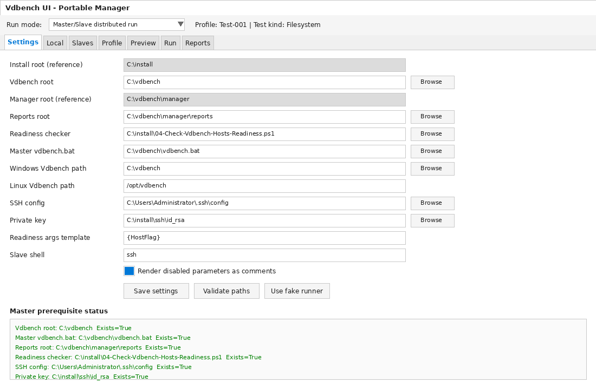
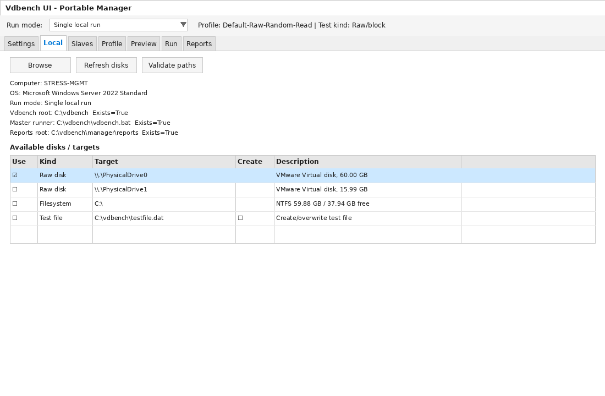
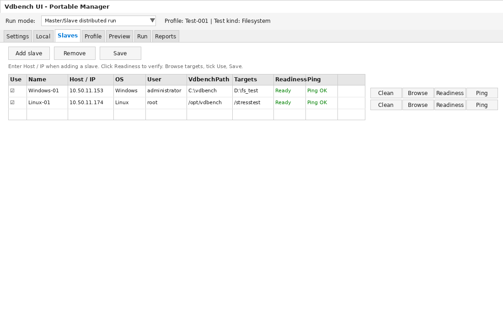
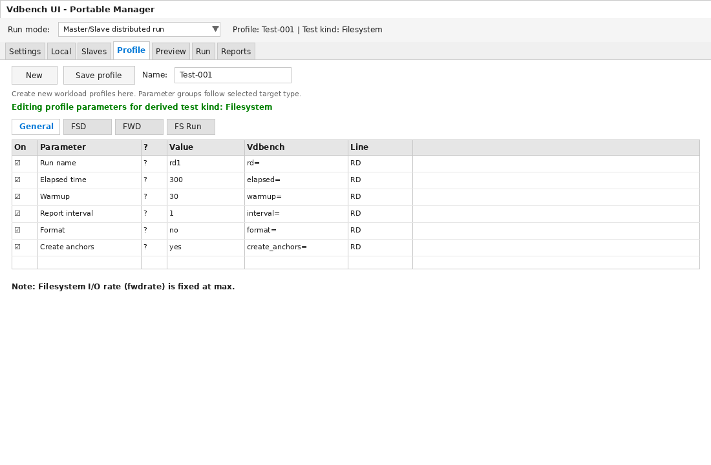
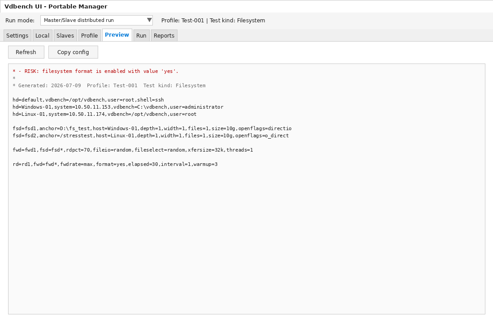
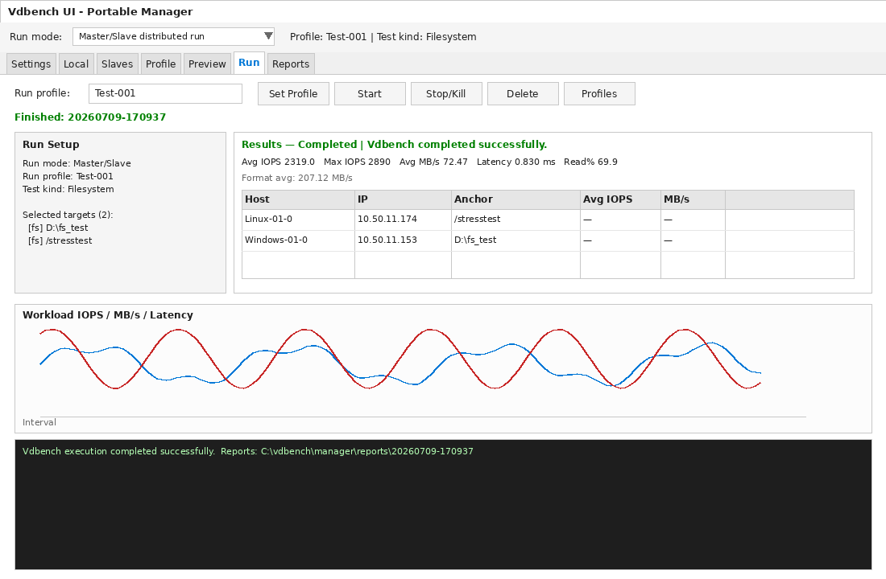
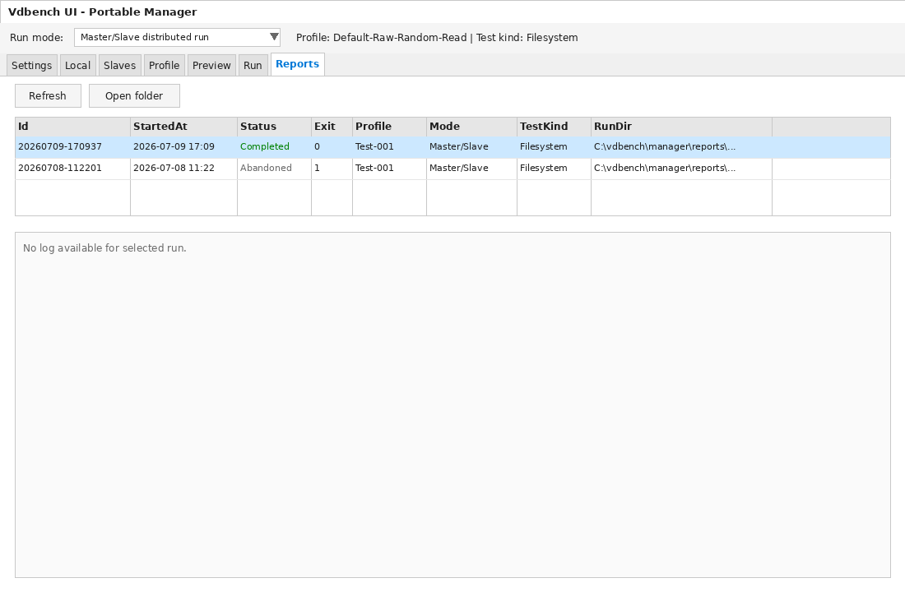

# Vdbench UI — მომხმარებლის სახელმძღვანელო (ქართული)

<p align="center">
  <a href="../en/README.md"><b>Documentation</b></a> ·
  <a href="../en/README.md">English</a> ·
  <a href="./README.md">ქართული</a>
</p>

<p align="center">
  პორტატული Windows UI Oracle <strong>Vdbench</strong>-ის სტრეს-ტესტების მოსამზადებლად,
  გასაშვებად და შედეგების სანახავად — ერთ ჰოსტზე ან Master/Slave რეჟიმში (Windows + Linux).
</p>

> UI **თვითონ არ აყენებს** Java-ს, OpenSSH-ს ან Vdbench-ს. ჯერ მოამზადე master და slave-ები [`install/`](../../install/) ნაკრებით, შემდეგ გაუშვი UI.

---

## სარჩევი

1. [რას აკეთებს პროდუქტი](#1-რას-აკეთებს-პროდუქტი)
2. [წინაპირობები და install ნაკრები](#2-წინაპირობები-და-install-ნაკრები)
3. [Master და Slave-ების მომზადება](#3-master-და-slave-ების-მომზადება)
4. [UI-ის გაშვება](#4-ui-ის-გაშვება)
5. [Settings](#5-settings)
6. [Local (ერთჰოსტიანი გაშვება)](#6-local-ერთჰოსტიანი-გაშვება)
7. [Slaves (განაწილებული გაშვება)](#7-slaves-განაწილებული-გაშვება)
8. [Profile](#8-profile)
9. [Preview](#9-preview)
10. [Run](#10-run)
11. [Reports](#11-reports)
12. [უსაფრთხო საცდელი გაშვება](#12-უსაფრთხო-საცდელი-გაშვება)
13. [მნიშვნელოვანი გაფრთხილებები](#13-მნიშვნელოვანი-გაფრთხილებები)

---

## 1. რას აკეთებს პროდუქტი

| შესაძლებლობა | აღწერა |
|---|---|
| ლოკალური გაშვება | Vdbench მხოლოდ ამ Windows Server-ზე |
| განაწილებული გაშვება | Master + ერთი ან რამდენიმე Windows/Linux slave SSH-ით |
| ტარგეტების არჩევა | Raw დისკები, ფაილსისტემები, სატესტო ფაილები (Browse / Use) |
| პროფილები | დატვირთვის პარამეტრები (xfersize, rdpct, elapsed, format, …) |
| Preview | გენერირებული `.parm` ტექსტი `RISK` გაფრთხილებებით Start-მდე |
| Run | ლოგი, გრაფიკი, ჰოსტების შეჯამება, Start / Stop |
| Reports | დასრულებული და შეწყვეტილი გაშვებების ისტორია |

ლაბის ტიპური ჰოსტები:

- **Master / UI:** Windows Server 2022 Desktop Experience  
- **Windows slave:** OpenSSH + Java + Vdbench  
- **Linux slave:** RHEL 9 (ან თავსებადი) SSH + Java + Vdbench  

---

## 2. წინაპირობები და install ნაკრები

მოსამზადებელი სკრიპტები რეპოშია **[`install/`](../../install/)** საქაღალდეში. ლაბის თითო ჰოსტზე დააკოპირე ეს საქაღალდე ასე:

| ჰოსტი | Staging გზა |
|---|---|
| Windows master / Windows slave | `C:\install` |
| Linux slave | `/root/install` |

UI-ის ველი **Install root (reference)** master-ზე `C:\install`-ზე მიუთითებს. სრული ჩექლისტი: [`install/REQUIRED-FILES.txt`](../../install/REQUIRED-FILES.txt).

### 2.1 `C:\install`-ის ფესვი (აუცილებელი ფაილები)

| ფაილი / საქაღალდე | სად სჭირდება | დანიშნულება |
|---|---|---|
| `01-Prepare-Vdbench-Master.ps1` | Master | Java, OpenSSH, Vdbench, SSH გასაღები master-ზე |
| `02-Prepare-Vdbench-Windows-Slave.ps1` | Windows slave | იგივე Windows slave-ზე + master’s საჯარო გასაღები |
| `03-Prepare-Vdbench-Linux-Slave-v4.3.sh` | Linux slave | RHEL 9 slave-ის ოფლაინ მომზადება |
| `04-Check-Vdbench-Hosts-Readiness.ps1` | Master (UI) | **Readiness** ღილაკი (ცალკე PowerShell ფანჯარა) |
| `REQUIRED-FILES.txt` | ყველა | ბინარული პაკეტების ჩექლისტი (git-ში არ არის) |
| `microsoft-jdk-11.0.31-windows-x64.exe` | Master + Win slave | Microsoft JDK 11 |
| `OpenSSH-Win64-v10.0.0.0.msi` | Master + Win slave | OpenSSH Client + Server |
| `vdbench50407.zip` | Master + ყველა slave | Oracle Vdbench არქივი (`C:\vdbench` / `/opt/vdbench`) |
| `java-11-openjdk-headless-11.0.25.0.9-7.el9.x86_64.rpm` | Linux slave | OpenJDK 11 (headless) RHEL 9-სთვის |
| `unzip-6.0-60.el9.x86_64.rpm` | Linux slave | ZIP-ის გახსნა Linux-ზე |
| `rpms\` | Linux slave | დამატებითი EL9 RPM-ები (ოფლაინ) |
| `ssh\` | Master (`01`-ის შემდეგ) | პირადი/საჯარო გასაღები (`id_rsa`) UI-სა და Vdbench-ისთვის |
| `master_id_ed25519.pub` | **ყველა slave** (master-დან კოპირება) | Master-ის საჯარო გასაღები — **აუცილებელია `02` / `03`-მდე** |
| `files\` | არასავალდებულო | დამატებითი ფაილები prepare სკრიპტებისთვის |

სკრიპტები მოდის რეპოს [`install/`](../../install/) საქაღალდიდან. ბინარული პაკეტები git-ში **არ არის** — დაამატე `REQUIRED-FILES.txt`-ის მიხედვით.

### 2.2 `C:\install\rpms` (Linux ოფლაინ დამოკიდებულებები)

მთელი `rpms` საქაღალდე გადაიტანე Linux slave-ის staging-ში (`/root/install/rpms`). ტიპური შემადგენლობა:

| RPM | რისთვის |
|---|---|
| `alsa-lib-*.rpm` | Java-ს დამოკიდებულება |
| `cups-libs-*.rpm` | Java-ს დამოკიდებულება |
| `copy-jdk-configs-*.rpm`, `javapackages-filesystem-*.rpm` | JDK პაკეტირება |
| `lksctp-tools-*.rpm` | Java SCTP მხარდაჭერა |
| `nspr-*.rpm`, `nss-*.rpm`, `nss-softokn-*.rpm`, `nss-softokn-freebl-*.rpm`, `nss-sysinit-*.rpm`, `nss-util-*.rpm` | NSS კრიპტო სტეკი OpenJDK-სთვის |
| `lua-*.rpm`, `lua-libs-*.rpm`, `lua-posix-*.rpm`, `compat-lua-*.rpm`, `compat-lua-libs-*.rpm` | ინსტალაციის სკრიპტების/პაკეტების დამოკიდებულებები |

ამ RPM-ების გარეშე ჰაერგაუშვებელ გარემოში Linux prepare ვერ დასრულდება (`OFFLINE_ONLY=1` ნაგულისხმევია).

### 2.3 ვის რა სჭირდება (ჩექლისტი)

| როლი | OS | UI გაშვებამდე უნდა გქონდეს |
|---|---|---|
| Master | Windows Server 2022 | JDK 11, OpenSSH Client+Server, Vdbench `C:\vdbench`, პირადი გასაღები `C:\install\ssh`, readiness სკრიპტი |
| Windows slave | Windows Server | JDK 11, OpenSSH Server, Vdbench `C:\vdbench`, master’s **საჯარო** გასაღები `administrators_authorized_keys`-ში |
| Linux slave | RHEL 9 | OpenJDK 11 (+ deps), `sshd`, Vdbench `/opt/vdbench`, master’s საჯარო გასაღები `/root/.ssh/authorized_keys`-ში |

---

## 3. Master და Slave-ების მომზადება

გაუშვი **Administrator**-ით (Windows) ან **root**-ით (Linux). ლაბის ნაგულისხმევი ხშირად თიშავს firewall/UAC/SELinux-ს — გამოიყენე მხოლოდ იზოლირებულ სტრეს-გარემოში.

### სავალდებულო თანმიმდევრობა (არ გამოტოვო)

```text
1) MASTER-ის მომზადება 01-*.ps1-ით
2) SSH საჯარო გასაღების (+ slave-ის პაკეტების) კოპირება ყველა slave-ზე
3) თითო SLAVE-ის მომზადება 02-*.ps1 / 03-*.sh-ით
4) შემოწმება 04-*.ps1 / UI Readiness-ით
```

> ### კრიტიკული: master-ის შემდეგ SSH ფაილი **ჯერ** გადააკოპირე slave-ებზე, **მერე** გაუშვი slave-ის სკრიპტი
>
> `01-Prepare-Vdbench-Master.ps1`-ის დასრულების შემდეგ master-ზე ჩნდება:
>
> | გზა master-ზე | რა არის |
> |---|---|
> | `C:\install\ssh\id_rsa` | პირადი გასაღები (რჩება master-ზე; იყენებს UI / Vdbench) |
> | `C:\install\ssh\id_rsa.pub` | საჯარო გასაღები |
> | `C:\install\master_id_ed25519.pub` | **Slave-ებისთვის ექსპორტი** (იგივე საჯარო გასაღები — ეს დააკოპირე) |
>
> **დააკოპირე `master_id_ed25519.pub` ყველა slave-ზე** მათ install საქაღალდეში:
>
> - Windows slave → `C:\install\master_id_ed25519.pub`
> - Linux slave → `/root/install/master_id_ed25519.pub`
>
> მხოლოდ **ამის შემდეგ** გაუშვი `02-Prepare-Vdbench-Windows-Slave.ps1` ან `03-Prepare-Vdbench-Linux-Slave-v4.3.sh`.  
> თუ slave-ის სკრიპტს ადრე გაუშვებ, ის ვერ იპოვის master’s საჯარო გასაღებს და master ვერ შეძლებს SSH-ით შემოსვლას.

### 3.1 Master (`01-Prepare-Vdbench-Master.ps1`)

```powershell
Set-ExecutionPolicy Bypass -Scope Process -Force
C:\install\01-Prepare-Vdbench-Master.ps1
```

რას აკეთებს (მოკლედ):

- აყენებს Microsoft JDK 11-ს და აყენებს `JAVA_HOME` / PATH-ს  
- აყენებს OpenSSH Client + Server-ს  
- ქმნის პაროლის გარეშე SSH გასაღებს (`C:\install\ssh`) და ამაგრებს ACL-ს პირად გასაღებზე  
- წერს `C:\install\master_id_ed25519.pub`-ს slave-ებზე გასავრცელებლად  
- ხსნის Vdbench-ს `C:\vdbench`-ში და ასწორებს `vdbench.bat`-ის classpath პრობლემას  
- ამზადებს განაწილებული რეჟიმის შაბლონებს  

სასარგებლო სვიჩები: `-RecreateSshKey`, `-ForceJavaInstall`, `-KeepFirewallEnabled`, `-KeepUACEnabled`.

### 3.2 SSH გასაღების კოპირება slave-ებზე (სავალდებულო ნაბიჯი)

Master-ზე 3.1-ის წარმატების შემდეგ დააკოპირე საჯარო გასაღები (USB, share, ან დროებითი სხვა ლოგინი):

```text
Master:  C:\install\master_id_ed25519.pub
   │
   ├──► Windows slave:  C:\install\master_id_ed25519.pub
   └──► Linux slave:    /root/install/master_id_ed25519.pub
```

ასევე გადაიტანე იმ slave-ის დანარჩენი ნაკრები (JDK/OpenSSH/ZIP ან Linux RPM-ები) `REQUIRED-FILES.txt`-ის მიხედვით. Master-ის **პირადი** გასაღები (`id_rsa`) slave-ებზე **არ** დააკოპირო.

### 3.3 Windows slave (`02-Prepare-Vdbench-Windows-Slave.ps1`)

მხოლოდ მას შემდეგ, რაც `master_id_ed25519.pub` უკვე არის slave-ის `C:\install`-ში:

```powershell
Set-ExecutionPolicy Bypass -Scope Process -Force
C:\install\02-Prepare-Vdbench-Windows-Slave.ps1
```

მოსალოდნელია:

- `microsoft-jdk-*-windows-x64.exe` (ან `.msi`)  
- `OpenSSH-Win64-*.msi`  
- `vdbench*.zip`  
- **`master_id_ed25519.pub`** (master-დან — იხ. §3.2)  

რებუტის შემდეგ master-დან შეამოწმე:

```text
ssh Administrator@<SLAVE_IP> hostname
ssh Administrator@<SLAVE_IP> java --version
ssh Administrator@<SLAVE_IP> C:\vdbench\vdbench.bat -t
```

### 3.4 Linux slave (`03-Prepare-Vdbench-Linux-Slave-v4.3.sh`)

განათავსე `/root/install`-ში (სკრიპტი + `vdbench*.zip` + **`master_id_ed25519.pub`** + RPM-ები / `rpms/`), შემდეგ:

```bash
cd /root/install
chmod +x ./03-Prepare-Vdbench-Linux-Slave-v4.3.sh
./03-Prepare-Vdbench-Linux-Slave-v4.3.sh
```

ნაგულისხმევი რეჟიმი **ოფლაინია**. ონლაინ ფოლბექი:

```bash
OFFLINE_ONLY=0 ./03-Prepare-Vdbench-Linux-Slave-v4.3.sh
```

შედეგი: აქტივები `/opt/install`-ში, Vdbench `/opt/vdbench`-ში.

### 3.5 Readiness (`04-Check-Vdbench-Hosts-Readiness.ps1`)

გაიშვება **master**-ზე. CLI მაგალითი:

```powershell
C:\install\04-Check-Vdbench-Hosts-Readiness.ps1 -WindowsHosts 10.50.11.153 -LinuxHosts 10.50.11.174
```

UI-ში **Readiness checker** მიუთითე ამ სკრიპტზე, ხოლო **Readiness args template** დააყენე `{HostFlag}`-ზე — თითო სტრიქონის **Readiness** ღილაკი ამოწმებს იმ სტრიქონის Host/IP-ს.

---

## 4. UI-ის გაშვება

Master-ზე, აპის (ან რეპოს) საქაღალდიდან:

```bat
Launch-VdbenchUI.bat
```

PowerShell იშვება **STA** რეჟიმში (სავალდებულოა Windows Forms-ისთვის).

ცვლადი მდგომარეობა:

| გზა | შიგთავსი |
|---|---|
| `data/settings.json` | ბილიკები და პარამეტრები |
| `data/slaves.json` | Slave-ების სია |
| `profiles/*.json` | შენახული პროფილები |
| `runs/` ან Reports root | Vdbench-ის გამოსავალი |
| `logs/app.log` | აპლიკაციის ლოგი |

---

## 5. Settings



პირველ განაწილებულ გაშვებამდე დააყენე ბილიკები. ტიპური მნიშვნელობები:

| ველი | მაგალითი | შენიშვნა |
|---|---|---|
| Install root (reference) | `C:\install` | მხოლოდ მითითება |
| Vdbench root | `C:\vdbench` | Master-ის ინსტალაცია |
| Reports root | `C:\vdbench\manager\reports` | გაშვებების გამოსავალი |
| Readiness checker | `C:\install\04-Check-Vdbench-Hosts-Readiness.ps1` | ცალკე ფანჯარაში იხსნება |
| Master vdbench.bat | `C:\vdbench\vdbench.bat` | უნდა არსებობდეს (`Exists=True`) |
| Windows / Linux Vdbench path | `C:\vdbench` / `/opt/vdbench` | ახალი slave-ების ნაგულისხმევი |
| SSH config / Private key | `.ssh\config` + `C:\install\ssh\id_rsa` | Browse / Clean / Readiness |
| Readiness args template | `{HostFlag}` | აუცილებელია მოწოდებული checker-ისთვის |

დააჭირე **Validate paths** და დარწმუნდი, რომ ყველა კრიტიკული გზა აჩვენებს **Exists=True**-ს.

ცვლილებების შემდეგ **Save settings**.

---

## 6. Local (ერთჰოსტიანი გაშვება)



1. **Run mode** → **Single local run**.  
2. გახსენი **Local**.  
3. **Refresh disks** / **Browse** — raw დისკები, ფაილსისტემები, სატესტო ფაილი.  
4. მონიშნე **Use** იმ ტარგეტებზე, რომლებზეც გინდა სტრესი.  
5. სატესტო ფაილისთვის სურვილისამებრ ჩართე **Create/overwrite file**.  

Raw დისკები და filesystem format დესტრუქციულია — Start-მდე ყოველთვის ნახე **Preview**.

---

## 7. Slaves (განაწილებული გაშვება)



1. **Run mode** → **Master/Slave distributed run**.  
2. **Add slave** — ჩაწერე რეალური **Host / IP** (არა მხოლოდ სახელი).  
3. დააყენე **OS**, **User** (`administrator` / `root`), **VdbenchPath**.  
4. **Ping**, შემდეგ **Readiness** (ცალკე PowerShell ფანჯარა; Enter-მდე დაელოდე).  
5. როცა სტატუსია **Ready**, ჩართე **Use**.  
6. **Browse** — აღმოაჩინე დისკები/ფაილსისტემები, საჭიროებისამებრ შექმენი საქაღალდე, მონიშნე **Use** ანქორებზე (მაგ. `D:\fs_test`, `/stresstest`).  
7. **Clean** — შლის არჩეული filesystem ანქორების **შიგთავსს** (raw დისკებს არა). სჭირდება მონიშნული filesystem ტარგეტები.  
8. **Save**.

გაშვებაში raw + filesystem ერთად აკრძალულია — ყველა არჩეული ტარგეტი ერთი ტიპის უნდა იყოს.

---

## 8. Profile



პროფილი ინახავს მხოლოდ **დატვირთვის პარამეტრებს** (არა ჰოსტების სიას).

1. ჯერ აირჩიე ტარგეტები **Local**-ზე ან **Slaves**-ზე (განსაზღვრავს Filesystem vs Raw/block).  
2. **Profile** → **New**, სახელი (მაგ. `Test-001`).  
3. დაარედაქტირე General / FSD / FWD / FS Run (filesystem) ან SD / WD (raw).  
4. **?** — ორენოვანი პარამეტრის დახმარება.  
5. **On**-ის მოხსნა გამორიცხავს პარამეტრს აქტიური კონფიგიდან (მნიშვნელობა რჩება; შეიძლება კომენტარად გამოჩნდეს).  
6. **Save profile**.

მაგალითები: elapsed, warmup, interval, format, create_anchors, rdpct, xfersize, threads. Filesystem-ის `fwdrate` ამ UI-ში ფიქსირებულია `max`-ზე.

---

## 9. Preview



ნაჩვენებია გენერირებული Vdbench `.parm`:

- `hd=` — ჰოსტების განსაზღვრა (`system=`, `user=`, `vdbench=`)  
- `fsd=` / `sd=` — ფაილსისტემა ან raw  
- `fwd=` / `wd=` — დატვირთვა  
- `rd=` — გაშვების განსაზღვრა  

წითელი **RISK** ხაზები (მაგ. `format=yes`) ნიშნავს, რომ ანქორზე მონაცემები შეიძლება გადაიწეროს. გამოიყენე **Refresh** / **Copy config**.

---

## 10. Run



1. აირჩიე შენახული **Run profile**.  
2. შეამოწმე **Run Setup** (რეჟიმი, ტესტის ტიპი, ტარგეტები).  
3. სურვილისამებრ **Config only** — მხოლოდ `.parm` და საქაღალდე, Vdbench გარეშე.  
4. **Start** — ლოგი, გრაფიკი (IOPS / MB/s / latency), ჰოსტების ცხრილი.  
5. საჭიროებისას **Stop/Kill**.  

დასრულებისას რეპორტები იწერება Reports root-ში (მაგ. `C:\vdbench\manager\reports\20260709-170937`).

---

## 11. Reports



გაშვებების ისტორია: Id, StartedAt, Status (`Completed` / `Abandoned`), ExitCode, Profile, Mode, TestKind, RunDir.

- **Refresh** — სიის განახლება  
- **Open folder** — არჩეული გაშვების საქაღალდე Explorer-ში  

---

## 12. უსაფრთხო საცდელი გაშვება

რეალურ დისკებამდე:

1. Settings → **Use fake runner** → Save  
2. მოკლე გაშვება **Run**-დან  
3. შეამოწმე ლოგი და რეპორტის საქაღალდე  
4. პროდაქშენამდე დააბრუნე **Master vdbench.bat** რეალურ `C:\vdbench\vdbench.bat`-ზე  

---

## 13. მნიშვნელოვანი გაფრთხილებები

- Vdbench-მა შეიძლება გაანადგუროს მონაცემები raw დისკებზე და ფორმატირებულ ფაილსისტემის ანქორებზე.  
- გამოიყენე მხოლოდ სტრესისთვის გამოყოფილი დისკები / ცარიელი ანქორები (`D:\fs_test`, `/stresstest`) — არა პროდაქშენ ვოლიუმები.  
- **Clean** შლის filesystem-ის **შიგთავსს**; ეს მონაცემები აღდგენადი არ არის.  
- SSH მიემართება თითო slave-ის **Host / IP**-სა და User-ს. **Name** მხოლოდ ეტიკეტია.  
- UI არ ჩამოტვირთავს Oracle Vdbench-ს; `vdbench50407.zip` თვითონ უნდა მოიტანო ლეგალურად.

---

## დამატებითი ტექნიკური დეტალი

- [Master / Slave მოდელი](../MASTER_SLAVE_MODEL.md) (ინგლისურად)  
- [პროექტის გეგმა / არქიტექტურა](../PROJECT_PLAN.md) (ინგლისურად)  
- უკან: [რეპოზიტორიის README](../../README.md)
